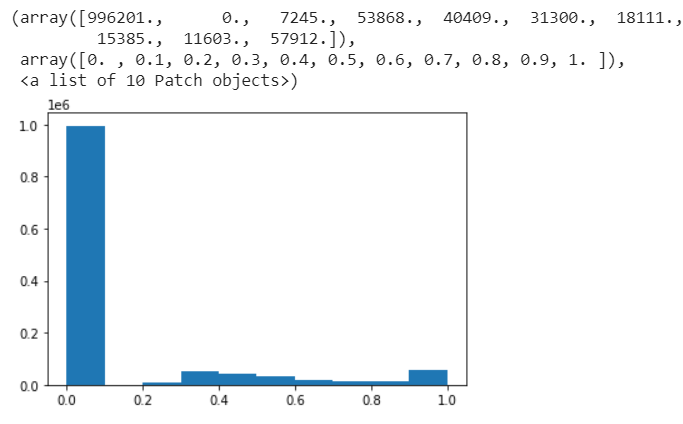
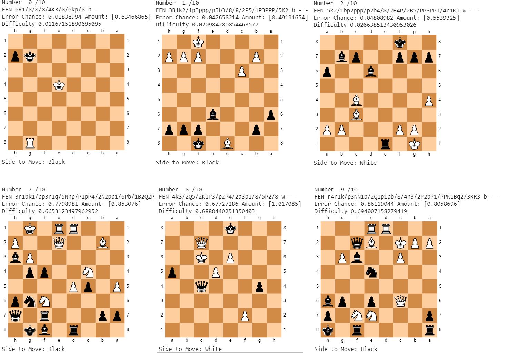
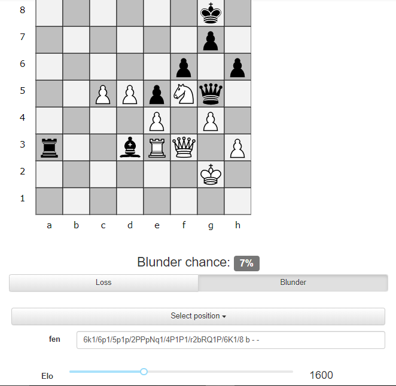

About
=====
Supervised learning to estimate the complexity of chess positions.

This project is based off of these resources:

1) [Learning to Evaluate Chess Positions with Deep Neural Networks and Limited Lookahead](https://www.ai.rug.nl/~mwiering/GROUP/ARTICLES/ICPRAM_CHESS_DNN_2018.pdf) by Sabatelli et al. showing dense neural networks can approximate the Stockfish evaluation function.
2) cgoldammer's work using dense networks to evaluate chess position complexity. [https://github.com/cgoldammer/chess-analysis/blob/master/position_sharpness.ipynb](https://github.com/cgoldammer/chess-analysis/blob/master/position_sharpness.ipynb)

Accessing Files
-----
TBD

Overview
-----
Chess engines easily defeat the best chess players, but they do not provide reasoning for their evaluations. Thus, they are not very useful as training partners, despite their ability to accurately evaluate positions and suggest strong moves. Similar to the previous work of cgoldammer, this project seeks to create more "human" engines that can predict how complex or difficult positions are for  chessplayers.

Methodology
=====
We take [25,000 games evaluated by Stockfish (1sec/move)](https://www.kaggle.com/c/finding-elo/data) on Kaggle and process them into training examples mapping the position (1x769 a binary vector with the locations of the pieces and whose turn it is) to the error of the move (calculated by the evaluation before the move minus the evaluation after the move). Similar to past work, we omit positions where the evaluation exceeds 300 centipawns (indicating a winning position), positions before move 12 (indicating opening theory), and scale errors so they do not exceed 100 centipawns. In addition, we also round errors below 30 centipawns to 0, as Stockfish at 1 second per move can sometimes indicate small errors even with perfect moves.

A Two-Headed Approach
-----
Unlike previous work, which mapped a position to an expected centipawn error using only one dense network, we use two networks, one predicting whether or not the user made an error (the classification network) and one predicting how large an error would be if it were made (the regression network). Due to the massive amount of training examples with 0 error, we chose this approach to give our regression network more flexibility and prevent it from only outputting low error values to minimize mean-squared loss.

Because there are significantly more positions with no error than error, we trained the classification network with a subset of the positions with no error to train with a dataset of 50% errors and 50% no errors. This prevents the network from predicting each position will have no error to minimize categorical loss.

A historgram of training examples and error.

Furthermore, this approach gives chessplayers a better sense of the complexity of a position, as complex positions can involve deciding between the best move and an alternative, and the probability of choosing the right move and the cost of choosing the wrong move is more descriptive than mean error.

Network Architecture
-----
We split the Kaggle game data into 5 rating categories (<1600, 1600-1900, 1900-2200, 2200-2500, 2500+) and trained five regression models and five classification models. All models had 20% dropout rates between dense layers (excluding output), and used relu to connect dense layers. Classification layers used softmax for output. The <1600 elo regression model trained on less data, so it is a 100-5-1 model. For the other rating categories, the models used were 1048-500-50 (taken from the Sabatelli paper). The classification models were trained on a dataset of 50% error positions and 50% non-error positions, and the regression models were trained on the error amounts in positions where the error exceeded 0. All models were trained with a learning rate of 0.001.

Results
=====
Almost all models achieved a 65% classification accuracy on the test set (around 0.63 categorical cross-entropy loss) and a mean-squared error loss of around 0.06 (about a 0.2 mean absolute error). The models are pretty successful in seperating complex positions from non-complex positions. Complexity is approximated by the probability of an error given by the classification model multiplied by the mean value of the error given by the regression model. However, this is a relative measurement of complexity, not a measure of expected centipawn loss. Below are three of the most complex positions (deemed by the 1900-2200 model, which trained on the most amount of data - roughly 100k positions) along with three of the simplest positions chosen out of 1000 random positions from the 2015 World Cup.

On the top are the hard positions, on the bottom are the easier positions.

Comparison to Previous Results
-----
Despite some methodological changes from the previous work of cgoldammer that in theory should improve performance, such as more stable evaluations (running Stockfish for 1 second/move instead of 0.1 seconds per move) and using two neural networks to better balance the data, there is no significant evidence that this program evaluates complexity better than [cgoldammer's model](https://chessinsights.org/analysis/). Positions evaluated as relatively complicated by this model are likewise evaluated as relatively complicated by the other model. I believe there is little difference in performance because of the vast amount of data used to train the other model (770,000 examples versus 100,000). However, removing bias does seem to have produced more user-friendly predictions. As suspected, cgoldammer's model regression on a training set with a large majority of little error positions has resulted in both a low regression and blunder value.

For instance, take the position in the upper right, estimated to have a chance of error of 77% and an error amount of 73 centipawns. Try to find the best move for Black here.

cgoldammer's model predicts that for an intermediate player (roughly 1600 elo) there is a 7% chance of a blunder. For an elo of 1000, there is an 11% chance of a blunder, and for an expert (roughly 2000 elo) there is a 5% chance of a blunder. The model also predicts a 44 centipawn loss for a 1600 player. This seems to imply that almost everyone will find the right move. However, the only move that gives Black a fighting chance is ...Qf4, which is a very difficult tactic to spot. Any other move loses at least 240 centipawns, which fits the criteria of a blunder. It is clear that the projections of the 1900-2200 elo model are more accurate, and most players will be challenged to find ...Qf4.

Applications
=====
This project along with the work of cgoldammer strongly indicates that neural networks can classify positions based on their relative difficulty to humans. **Such a program has massive unrealized applications in the chess world, and websites like lichess and chess.com already have millions of computer-analyzed games to realize these opportunities.**

1) Chess Training - A program that can rank position difficulties can expand the boundaries of chess puzzles beyond tactics to all types of positions. As users solve more positions, there is no reason why the model can't update itself with this data to provide more personalized training as well.

2) Elo Estimation - If rating was factored into the model (either as an input or by training many seperate models), models can be extended to estimate rating based on games.

Notes and Improvements
=====
1) One minor error that can occur is the model sometimes classifies a messy position with only one legal move as a complex position. This might be fixable by adding more hand-crafted inputs to the network, like number of legal moves. The program was trained only on the position of the pieces on the board to minimize prior knowledge of chess.

2) Hyperparameter tuning and model selection - I stuck to the models in the Sabatelli paper and cgoldammer's work, but there might be a better model. 
